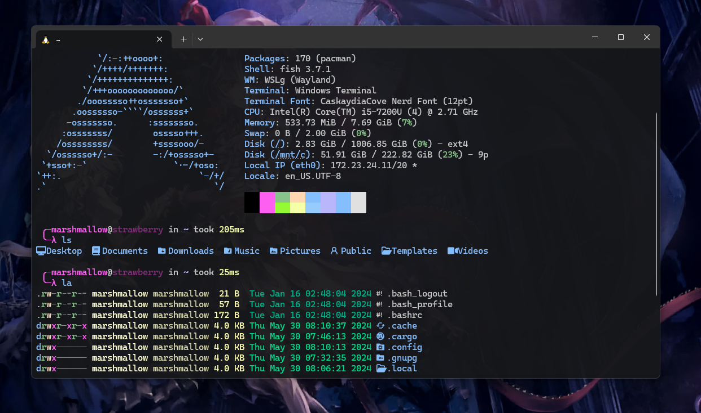

# Beauty Arch WSL



Arch wsl on fish with enabled multilib, chaotic aur, preinstalled git and paru

## WSL

install wsl if you don't have it

> wsl --update

## Windows Terminal

install scoop if you don't have it

> Set-ExecutionPolicy -ExecutionPolicy RemoteSigned -Scope CurrentUser

> Invoke-RestMethod -Uri https://get.scoop.sh | Invoke-Expression

> scoop install git

> scoop bucket add main

> scoop bucket add extras

install fonts

> scoop bucket add nerd-fonts

> scoop install nerd-fonts/FiraCode-NF

> scoop install nerd-fonts/CascadiaCode-NF

add atom theme: 

> notepad "$env:USERPROFILE\AppData\Local\Packages\Microsoft.WindowsTerminal_8wekyb3d8bbwe\LocalState\settings.json"


add the code to the schemes section:

```
{
  "name": "Atom",
  "black": "#000000",
  "red": "#fd5ff1",
  "green": "#87c38a",
  "yellow": "#ffd7b1",
  "blue": "#85befd",
  "purple": "#b9b6fc",
  "cyan": "#85befd",
  "white": "#e0e0e0",
  "brightBlack": "#000000",
  "brightRed": "#fd5ff1",
  "brightGreen": "#94fa36",
  "brightYellow": "#f5ffa8",
  "brightBlue": "#96cbfe",
  "brightPurple": "#b9b6fc",
  "brightCyan": "#85befd",
  "brightWhite": "#e0e0e0",
  "background": "#161719",
  "foreground": "#c5c8c6",
  "selectionBackground": "#444444",
  "cursorColor": "#d0d0d0"
}
```

go to windows terminal `settings > profiles > defaults > apperance` and apply `Atom` theme and `CaskaydiaCove Nerd Font`, also set the transparency to a level you like

## Arch WSL

download arch wsl image and place to desktop

[mega.nz/BeautyArch.tar](https://mega.nz/file/sI81CbBC#ZmHkZ9r4y1yqMuyzLDtBlnbM4Lw1mdBHc0hmZZdx8Dg)

make folder for arch distro

> New-Item -ItemType Directory -Path C:\wsl\BeautyAarch -Force

import 

> wsl --import 
BeautyArch C:\WSL\BeautyArch "$env:USERPROFILE\Desktop\BeautyArch.tar"


## Configure Arch

default

    username: marshmallow
    password: blizzard

to change password

> passwd

update mirrors

> sudo reflector --verbose --latest 15 --sort rate --save /etc/pacman.d/mirrorlist

update system

> sudo pacman -Syu

enable fish history

> touch ~/.fish_history

> set -U fish_history fish

## Change username 

> sudo usermod -l new_name old_name

> sudo usermod -d /home/new_name -m new_name

> su new_name

don't forget to change the wsl user

> nano /etc/wsl.conf

    [user]
    default=username

## Manual

if you want to install arch from scratch read the `manual.md`
